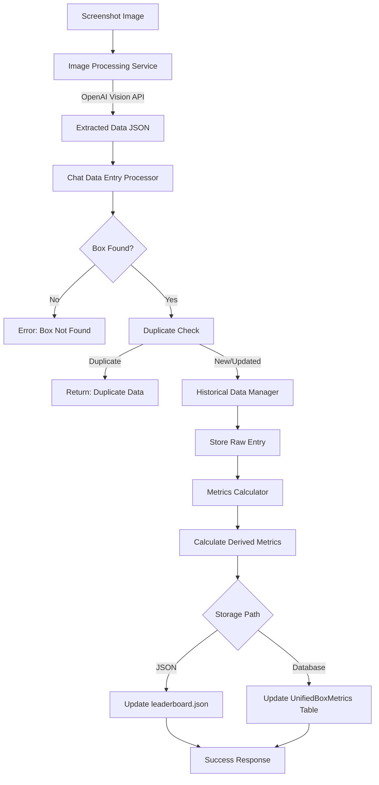

# Screenshot Data Capture and Implementation Guide

This document provides a comprehensive overview of what data is captured from screenshots and how it's processed, stored, and transformed in the BoosterBoxPro system.

## Table of Contents

1. [Data Fields Captured](#data-fields-captured)
2. [Implementation Architecture](#implementation-architecture)
3. [Data Flow](#data-flow)
4. [Field Mapping and Transformation](#field-mapping-and-transformation)
5. [Storage Locations](#storage-locations)
6. [Calculation Rules](#calculation-rules)
7. [Key Implementation Files](#key-implementation-files)

---

## Data Fields Captured

### Primary Fields Extracted by AI Vision

When a screenshot is processed, the OpenAI Vision API (GPT-4o) extracts the following fields if they are visible in the image:

| Field Name | Type | Description | Example |
|------------|------|-------------|---------|
| `product_name` | string | Box name or set code | "OP-01", "One Piece OP-02" |
| `floor_price_usd` | number | Lowest listing price in USD | 120.50 |
| `active_listings_count` | number | Number of active listings shown | 45 |
| `boxes_sold_today` | number | Boxes sold today (if visible) | 3 |
| `daily_volume_usd` | number | Daily volume in USD (if visible) | 361.50 |
| `visible_market_cap_usd` | number | Visible market cap (if visible) | 5422.50 |
| `boxes_added_today` | number | Boxes added today (if visible) | 2 |
| `estimated_total_supply` | number | Estimated total supply (if visible) | 1000 |
| `other_metrics` | object | Any other relevant metrics found | {} |

**Extraction Location**: [`app/services/image_processing.py`](app/services/image_processing.py)
- Lines 77-104: OpenAI Vision API prompt specification
- Lines 91-101: JSON structure expected from AI
- Lines 154-161: Return structure with extracted data and confidence scores

**Important Notes**:
- All fields are optional - only visible data is extracted
- Missing fields are returned as `null`
- Confidence scores are calculated (0.85 for numeric, 0.70 for text, 0.0 for missing)

---

## Implementation Architecture

### System Components

```
┌─────────────────────┐
│   Screenshot Image  │
└──────────┬──────────┘
           │
           ▼
┌─────────────────────┐
│ Image Processing    │ ← OpenAI Vision API (GPT-4o)
│ Service             │
└──────────┬──────────┘
           │ Extracted Data
           ▼
┌─────────────────────┐
│ Chat Data Entry     │ ← Box matching, duplicate detection
│ Processor           │
└──────────┬──────────┘
           │
           ├──────────────────────┐
           │                      │
           ▼                      ▼
┌─────────────────────┐  ┌─────────────────────┐
│ Historical Data     │  │ Metrics Calculator  │
│ Manager             │  │                     │
│ (Raw Storage)       │  │ (Derived Metrics)   │
└──────────┬──────────┘  └──────────┬──────────┘
           │                        │
           └──────────┬─────────────┘
                      │ Calculated Metrics
                      ▼
           ┌─────────────────────┐
           │   Data Storage      │
           ├─────────────────────┤
           │ • JSON File         │
           │ • Database (opt)    │
           └─────────────────────┘
```

---

## Data Flow

### Step 1: Image Processing
**File**: [`app/services/image_processing.py`](app/services/image_processing.py)

1. Receives image bytes from screenshot upload
2. Converts image to base64 encoding (line 74)
3. Sends to OpenAI Vision API (GPT-4o) with structured extraction prompt (lines 107-125)
4. Parses JSON response from AI (lines 131-140)
5. Calculates confidence scores for each field (lines 142-152)
6. Returns structured data dictionary with:
   - `extracted_data`: Dictionary of all extracted fields
   - `confidence_scores`: Confidence level for each field
   - `detected_box`: Product name detected
   - `raw_text`: Full AI response for debugging
   - `success`: Boolean indicating success/failure
   - `errors`: List of any errors encountered

**API Configuration**:
- Model: `gpt-4o`
- Temperature: `0.1` (low for accuracy)
- Max tokens: `1000`
- Prompt: Structured JSON extraction request (lines 77-104)

### Step 2: Data Processing
**File**: [`scripts/chat_data_entry.py`](scripts/chat_data_entry.py) - `process_screenshot_entry()`

1. **Receives extracted data** from image processing service (line 370)
2. **Validates extraction** - checks for product_name (lines 381-386)
3. **Finds matching box** using fuzzy matching by:
   - Set code (OP-01, EB-01, etc.) regex matching (lines 395-403)
   - Product name partial matching (line 406)
4. **Date handling**:
   - Uses provided `entry_date` if specified
   - Validates date format (YYYY-MM-DD) (lines 417-426)
   - Defaults to today's date if not provided (line 428)
5. **Auto-detects data type** (lines 430-443):
   - `"sales"`: Has sales/volume data
   - `"listings"`: Has listing/price data
   - `"combined"`: Has both types
   - `"auto"`: Determines from data presence
6. **Duplicate detection** (lines 446-465):
   - Checks if entry exists for same box, date, and type
   - Uses `metrics_calculator.identify_new_data()` to compare
   - Returns early if duplicate with no new information
7. **Stores raw entry** in historical data (lines 468-486):
   - Creates entry dictionary with all extracted fields
   - Adds metadata (confidence scores, timestamp)
   - Calls `historical_data_manager.add_entry()`

### Step 3: Historical Data Storage
**File**: [`scripts/historical_data_manager.py`](scripts/historical_data_manager.py)

Stores raw screenshot entries in `data/historical_entries.json`:
- Structure: `{box_id: [entries...]}`
- Each entry includes:
  - `date`: ISO date string
  - `source`: "screenshot" or "manual"
  - `data_type`: "sales", "listings", or "combined"
  - All extracted fields from screenshot
  - `screenshot_metadata`: Confidence scores, extraction timestamp
  - `timestamp`: When entry was added

**Key Functions**:
- `add_entry()`: Adds new historical entry (lines 45-83)
- `merge_entries()`: Merges multiple entries for same date (lines 114-150)
- `get_box_history()`: Retrieves all entries for a box (line 40)

### Step 4: Metrics Calculation
**File**: [`scripts/metrics_calculator.py`](scripts/metrics_calculator.py) - `calculate_daily_metrics()`

Calculates derived metrics from historical data:

**Directly Passed Through** (from most recent entry):
- `floor_price_usd` - Current floor price (line 49)
- `active_listings_count` - Current listings count (line 78)
- `daily_volume_usd` - Current daily volume (line 60)
- `boxes_added_today` - Boxes added today (line 83)

**Calculated Metrics**:
- `floor_price_1d_change_pct` - 1-day price change percentage (lines 51-55)
- `unified_volume_7d_ema` - 7-day exponential moving average of volume (lines 62-65)
- `boxes_sold_per_day` - Average boxes sold per day (line 72)
- `boxes_sold_30d_avg` - 30-day average sales (line 73)
- `listed_percentage` - Percentage of supply listed (lines 87-94)
- `visible_market_cap_usd` - Floor price × estimated supply (lines 97-103)
- `liquidity_score` - Blended liquidity metric (lines 106-110)
- `days_to_20pct_increase` - Time to 20% price increase (lines 113-116)
- `expected_days_to_sell` - Expected days to sell all listings (lines 119-123)

### Step 5: Final Storage

#### JSON Storage Path (Primary)
**File**: [`scripts/chat_data_entry.py`](scripts/chat_data_entry.py) - `update_box_data()`

Updates `data/leaderboard.json`:
- Finds box by ID in JSON structure
- Updates metrics dictionary with calculated values (lines 237-239)
- Updates `metric_date` field (line 242)
- Saves updated JSON file (line 253)

#### Database Storage Path (Alternative)
**File**: [`scripts/manual_data_entry.py`](scripts/manual_data_entry.py) - `add_metrics()`

Stores directly in PostgreSQL database:
- Table: `box_metrics_unified` (UnifiedBoxMetrics model)
- Maps extracted fields to database columns (lines 133-144, 157-162)
- Creates new record or updates existing one (lines 131-171)
- Field mapping:
  - `floor_price_usd` → `floor_price_usd`
  - `active_listings_count` → `active_listings_count`
  - `boxes_sold_today` → `boxes_sold_per_day`
  - `daily_volume_usd` → `unified_volume_usd`
  - `visible_market_cap_usd` → `visible_market_cap_usd`
  - `boxes_added_today` → `boxes_added_today`

---

## Field Mapping and Transformation

### Extraction → Storage Mapping

| Extracted Field | Historical Storage | JSON Storage | Database Column |
|----------------|-------------------|--------------|-----------------|
| `product_name` | (used for matching) | (not stored) | (not stored) |
| `floor_price_usd` | `floor_price_usd` | `floor_price_usd` | `floor_price_usd` |
| `active_listings_count` | `active_listings_count` | `active_listings_count` | `active_listings_count` |
| `boxes_sold_today` | `boxes_sold_today` | (calculated) | `boxes_sold_per_day` |
| `daily_volume_usd` | `daily_volume_usd` | `daily_volume_usd` | `unified_volume_usd` |
| `visible_market_cap_usd` | `visible_market_cap_usd` | `visible_market_cap_usd` | `visible_market_cap_usd` |
| `boxes_added_today` | `boxes_added_today` | `boxes_added_today` | `boxes_added_today` |
| `estimated_total_supply` | `estimated_total_supply` | (not stored) | (not stored) |

### Calculated Fields (Not Directly Extracted)

These fields are calculated by `metrics_calculator.py` and stored in JSON/database:

| Calculated Field | Calculation Method | Storage Location |
|-----------------|-------------------|------------------|
| `floor_price_1d_change_pct` | Percentage change from previous day | JSON + Database |
| `unified_volume_7d_ema` | 7-day exponential moving average | JSON + Database |
| `boxes_sold_per_day` | Average of recent sales data | JSON + Database |
| `boxes_sold_30d_avg` | 30-day average of sales | JSON + Database |
| `listed_percentage` | (active_listings / estimated_supply) × 100 | JSON + Database |
| `liquidity_score` | Complex liquidity calculation | JSON + Database |
| `expected_days_to_sell` | active_listings / boxes_sold_per_day | JSON + Database |

---

## Storage Locations

### 1. Historical Raw Data
**File**: `data/historical_entries.json`
- **Purpose**: Stores raw screenshot entries for historical tracking
- **Structure**: `{box_id: [entry1, entry2, ...]}`
- **Manager**: [`scripts/historical_data_manager.py`](scripts/historical_data_manager.py)
- **Used for**: Duplicate detection, metrics calculation, historical analysis

### 2. Leaderboard Data (JSON)
**File**: `data/leaderboard.json`
- **Purpose**: Current metrics for all boxes (for API/UI)
- **Structure**: `{data: [{box1}, {box2}, ...]}`
- **Updater**: `ChatDataEntry.update_box_data()` in [`scripts/chat_data_entry.py`](scripts/chat_data_entry.py)
- **Used for**: Frontend display, API responses

### 3. Database Storage (PostgreSQL)
**Table**: `box_metrics_unified`
- **Purpose**: Persistent storage with relational integrity
- **Model**: [`app/models/unified_box_metrics.py`](app/models/unified_box_metrics.py)
- **Updater**: `add_metrics()` in [`scripts/manual_data_entry.py`](scripts/manual_data_entry.py)
- **Used for**: Production data storage, analytics, reporting

---

## Calculation Rules

### User-Specified Rules

The following rules should be applied when processing screenshots (documented in [`scripts/README_SCREENSHOT_DATA_ENTRY.md`](scripts/README_SCREENSHOT_DATA_ENTRY.md)):

1. **Floor Price Calculation**: 
   - **Rule**: Calculate **price + shipping** as the total floor price
   - **Status**: ⚠️ **Not yet implemented in code**
   - **Location**: Should be applied in image processing prompt or post-processing

2. **Platform Equality**:
   - **Rule**: Treat **eBay and TCGPlayer as equal** sources
   - **Status**: ⚠️ **Not yet implemented in code**
   - **Location**: Should be considered when extracting/weighting floor prices

3. **Sales Filtering**:
   - **Rule**: **Do not count super low sales** when calculating metrics
   - **Status**: ⚠️ **Not yet implemented in code**
   - **Location**: Should be applied in metrics calculation or data extraction

### Current Implementation Notes

- The OpenAI Vision API extracts whatever is visible in the screenshot
- No filtering is currently applied to exclude low sales
- Floor price is extracted as-is from the image (doesn't add shipping)
- Platform information is not currently tracked or weighted

**Recommendation**: These rules should be implemented in:
1. The OpenAI prompt (to instruct AI to include shipping in floor price)
2. Post-processing step (to filter low sales)
3. Metrics calculation (to handle platform equality)

---

## Key Implementation Files

### Core Processing Files

1. **`app/services/image_processing.py`**
   - Image processing service
   - OpenAI Vision API integration
   - Data extraction logic
   - **Key class**: `ImageProcessingService`
   - **Key method**: `process_screenshot()`

2. **`scripts/chat_data_entry.py`**
   - Main screenshot processing orchestrator
   - Box matching and duplicate detection
   - Data type auto-detection
   - JSON file updates
   - **Key function**: `process_screenshot_entry()`
   - **Key class**: `ChatDataEntry`

3. **`scripts/historical_data_manager.py`**
   - Historical data storage and retrieval
   - Entry merging for same-day data
   - **Key class**: `HistoricalDataManager`

4. **`scripts/metrics_calculator.py`**
   - Derived metrics calculation
   - Historical data analysis
   - Duplicate detection logic
   - **Key class**: `MetricsCalculator`
   - **Key method**: `calculate_daily_metrics()`

### Database Files

5. **`app/models/unified_box_metrics.py`**
   - Database model definition
   - Field specifications
   - **Key class**: `UnifiedBoxMetrics`

6. **`scripts/manual_data_entry.py`**
   - Direct database entry (alternative path)
   - Database duplicate checking
   - **Key function**: `add_metrics()`

### Documentation Files

7. **`scripts/README_SCREENSHOT_DATA_ENTRY.md`**
   - User-facing documentation
   - Usage instructions
   - Calculation rules documentation

8. **`DATA_ENTRY_FORMAT.md`**
   - Data entry format guide
   - How to signal data entry requests

---

## Data Flow Diagram



---

## Summary

### What Gets Captured
- **8 primary fields** extracted from screenshots via OpenAI Vision API
- All fields are optional (only visible data is extracted)
- Confidence scores calculated for each field

### How It's Processed
1. **Image → AI Extraction**: OpenAI Vision API extracts structured data
2. **Box Matching**: Fuzzy matching by set code or product name
3. **Duplicate Detection**: Checks for existing entries
4. **Historical Storage**: Raw data stored in JSON
5. **Metrics Calculation**: Derived metrics calculated from history
6. **Final Storage**: Updates JSON file and optionally database

### What Gets Stored
- **Raw entries**: All extracted data in `historical_entries.json`
- **Calculated metrics**: Derived metrics in `leaderboard.json`
- **Database**: Optional direct storage in PostgreSQL

### Current Limitations
- ⚠️ Floor price calculation (price + shipping) not implemented
- ⚠️ Platform equality (eBay = TCGPlayer) not implemented
- ⚠️ Low sales filtering not implemented

---

## Appendix: Field Reference

### Complete Field List

#### Extracted Fields (from Screenshot)
- `product_name` (string)
- `floor_price_usd` (number)
- `active_listings_count` (number)
- `boxes_sold_today` (number)
- `daily_volume_usd` (number)
- `visible_market_cap_usd` (number)
- `boxes_added_today` (number)
- `estimated_total_supply` (number)
- `other_metrics` (object)

#### Calculated Fields (derived from historical data)
- `floor_price_1d_change_pct` (number)
- `unified_volume_7d_ema` (number)
- `boxes_sold_per_day` (number)
- `boxes_sold_30d_avg` (number)
- `listed_percentage` (number)
- `liquidity_score` (number)
- `days_to_20pct_increase` (number)
- `expected_days_to_sell` (number)
- `avg_boxes_added_per_day` (number)

#### Metadata Fields
- `confidence_scores` (object)
- `extraction_timestamp` (string)
- `source` (string: "screenshot" | "manual")
- `data_type` (string: "sales" | "listings" | "combined")
- `timestamp` (string)

